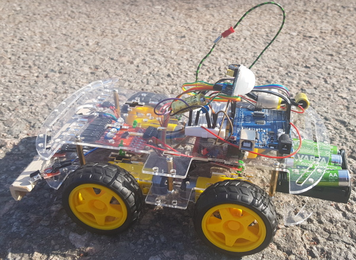

Asser's automatic auto demo
===========================

This is a simple Arduino based 4WD vehicle that drives on its own.

The vehicle has four infrared sensors at the front. The two sensors at the middle are pointing ahead and those at both sides are tilted slightly towards the edges.

We have a small 5V piezo buzzer for PWM sounds.

Each wheel is attached to a DC motor and they can be controlled to both directions but only in pairs of left and right motors.

At the top of the vehicle, we have a an infrared based motion detector for near by humans so that it can react to them.
